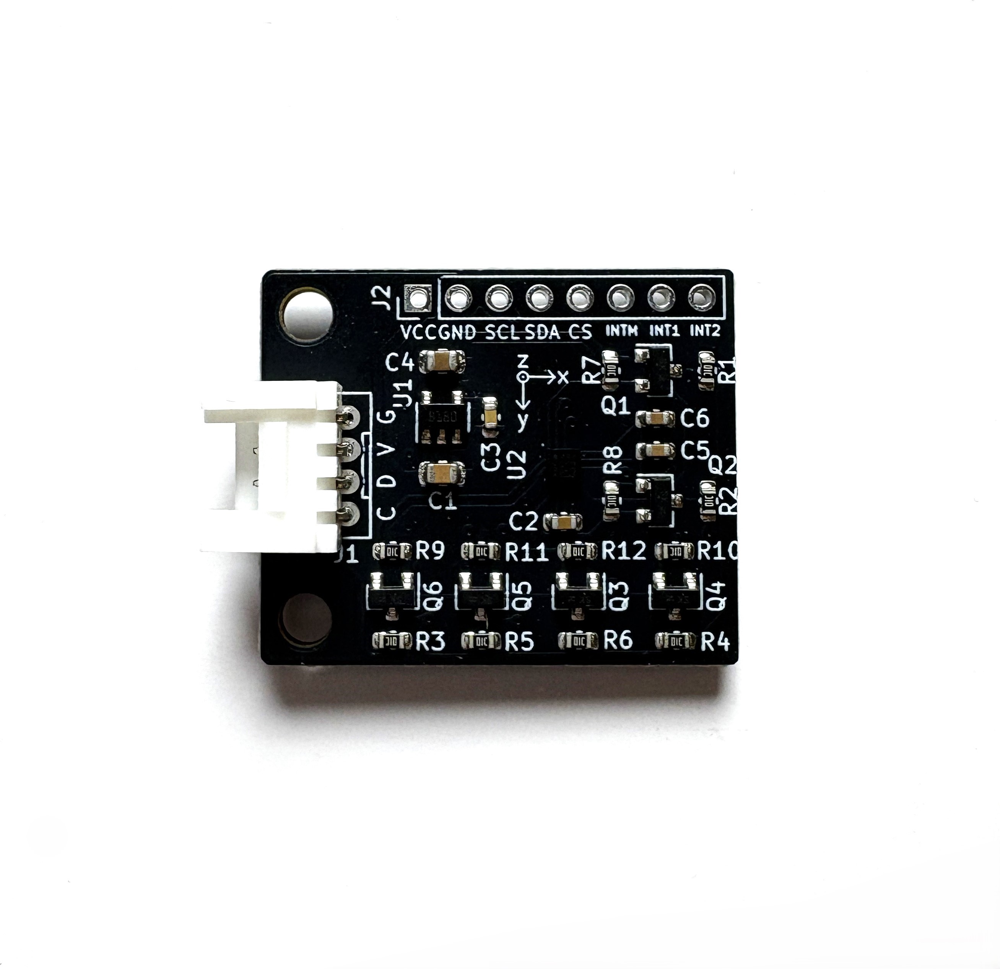
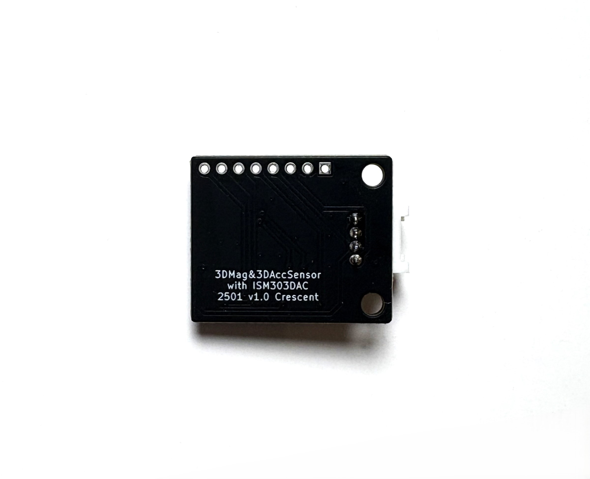

# 3D加速度/3D磁力センサ変換基板　
# 3D Magnetometer & 3D Accelerometer Board

## 概要 
  * ST製3D加速度/3D磁力センサ[ISM303DAC][1]を搭載した変換基板です 
  * 1つのセンサで3方向の磁界チャンネルと3方向の加速チャンネルを検出可能です    
  * 変換基板に電圧レベル変換を搭載しているため、3.3V/5V系に直結可能です
  * I2C/SPI/INTすべてのピンで電圧レベル変換を介してアクセス可能です  
  * I2CはGrove互換コネクタを搭載しています  
  * Arduino Uno等で利用可能なサンプルコードがあります  
 

## 仕様  
  * 磁界センサは最大±50ガウス磁気感度があります   
  * 加速度センサは±2/±4/±8/±16gから選択可能です  
  * 16bit分解能、256個のFIFOメモリを搭載しています    
  * SPI/I2Cシリアルインターフェイスを利用可能です
  * 急降下、動作、磁場検出のためのプログラマブルな割り込みに対応    
  * 電源電圧DC2.5V-5.0V  
  * サイズ30mm x25mm (突起部、コネクタ除く)

## 外観

[1]: https://www.st.com/ja/mems-and-sensors/ism303dac.html
